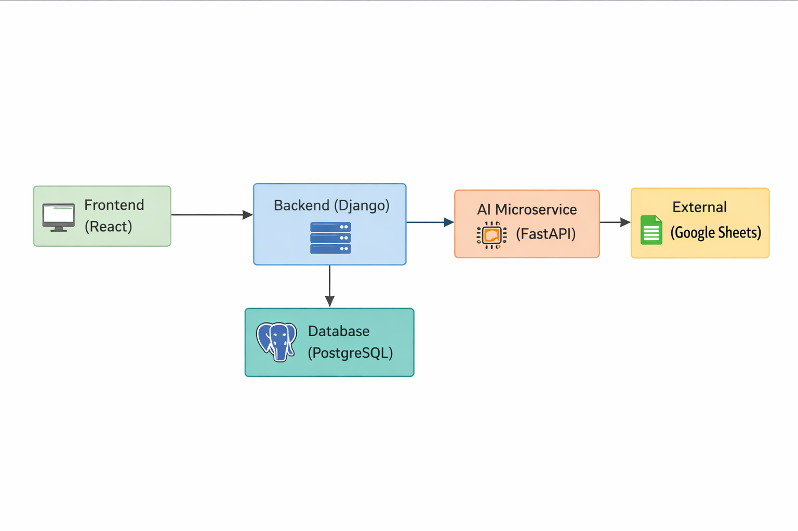

# Aplicação Acadêmica – Guia de Desenvolvimento

<p>Bem‑vindo ao repositório da aplicação acadêmica. Este projeto tem como objetivo auxiliar professores a gerenciar turmas e estudantes, lançar avaliações e notas, visualizar a evolução do desempenho e, futuramente, integrar um microserviço de inteligência artificial para correção de provas. Este documento resume as especificações técnicas, arquitetura e instruções para iniciar o desenvolvimento.</p>

<h2>Visão geral do projeto</H2>

<p><strong>Gestão de turmas e alunos</strong>: cadastro de disciplinas, unidades (escolas), turmas e estudantes. Possibilidade de transferir alunos entre turmas. </p>

<p><strong>Lançamento de avaliações e notas</strong>: suporte a diferentes tipos de avaliações (mensais, trimestrais, formativas, orais) com pesos. Controle de datas de aplicação, prazos de entrega e penalidade por atraso.</p>

<p><strong>Dashboards e métricas</strong>: cálculo de médias, desvios padrão e evolução das notas dos alunos; visualização em gráficos interativos com exportação para PDF.</p>

<p><strong>Integração externa</strong>: importação e exportação de dados via <strong>Google Sheets</strong>.</p>

<p><strong>Microserviço de IA (futuro)</strong>: correção de provas a partir de imagens e geração de feedback sobre os conceitos dominados ou não.</p>

<h2>Arquitetura</h2>

<p>A arquitetura é composta por dois serviços principais e componentes de apoio:</p>

<p><strong>Backend em Django</strong>: manipula dados, provê APIs REST para CRUD, autenticação e geração de dashboards.</p>

<p><strong>Microserviço de IA em FastAPI</strong>: recebe upload de imagens de provas, executa modelos de visão computacional e retorna resultados.</p>

<p><strong>Banco de dados PostgreSQL</strong>: armazena disciplinas, unidades, turmas, alunos, avaliações e notas.</p>

<p><strong>Frontend (opcional)</strong>: interfaces web podem ser renderizadas via templates do Django ou implementadas como SPA com React/Next.js.</p>

<p><strong>Integração com Google Sheets</strong>: módulo para importar e exportar dados de planilhas, com autenticação manual.</p>

## Stack tecnológica

<p>MsLinguagem: Python 3.11+</p>

<p><strong>Framework</strong>: Django para a aplicação principal; FastAPI para o microserviço de IA</p>

<p><strong>Banco de dados</strong>: PostgreSQL (SQLite em desenvolvimento)</p>

<p><strong>Frontend</strong>: Django Templates ou React/Next.js com bibliotecas de gráficos (Chart.js, Recharts)</p>

<p><strong>Bibliotecas de IA</strong>: OpenCV, PyTorch/TensorFlow, Pandas, NumPy </p>

<p><strong>Integração Sheets</strong>: gspread ou google-api-python-client</p>

## Estrutura de diretórios sugerida

app/
├── backend/ # Projeto Django
│ ├── manage.py
│ ├── core/ # App principal com modelos, views, serializers
│ ├── users/ # Autenticação e gestão de usuários
│ └── ...
├── ai_service/ # Microserviço FastAPI
│ ├── main.py
│ ├── models/ # Modelos de ML e utilitários
│ └── ...
└── README.md
Instruções para começar

Clone o repositório e crie um ambiente virtual

git clone <repositorio>
cd app
python3 -m venv .venv
source .venv/bin/activate

Instale as dependências

pip install -r requirements.txt

Configure variáveis de ambiente

Crie um arquivo .env com as credenciais do PostgreSQL e outras configurações (SECRET_KEY, DEBUG, etc.).

Para desenvolvimento, é possível utilizar SQLite removendo as variáveis de banco.

Inicialize o projeto Django

cd backend
python manage.py migrate
python manage.py createsuperuser
python manage.py runserver

Acesse o Django Admin

Entre em http://localhost:8000/admin com o superusuário criado para cadastrar disciplinas, turmas e alunos.

Configurar e iniciar o microserviço de IA (versão inicial)

Instale as dependências específicas e rode uvicorn ai_service.main:app --reload.

A integração completa com o backend será desenvolvida nas próximas sprints.

Endpoints REST básicos

/api/disciplinas/ – Criar e listar disciplinas

/api/unidades/ – Criar e listar unidades (escolas)

/api/turmas/ – Criar, listar e atualizar turmas; endpoint de transferência de alunos

/api/alunos/ – Criar e listar alunos

/api/avaliacoes/ – Criar e listar avaliações

/api/notas/ – Lançar notas dos estudantes

/api/dashboard/turma/{id}/ – Exibir métricas e dashboards

A implementação pode ser simplificada utilizando Django REST Framework.

Próximos passos

Dashboards avançados: aprimorar gráficos e exportação de relatórios

Importação/exportação de planilhas: implementar autenticação e leitura/escrita no Google Sheets

Correção automática: desenvolver pipeline de IA para processamento de provas

Deploy em nuvem: configurar pipelines de CI/CD e publicar em um provedor como Heroku, AWS ou DigitalOcean



## Setup rápido — IA self-hosted + RAG

1. Copie o arquivo de exemplo de ambiente:

```bash
cp app/.env.example app/.env
```

2. Suba o provedor local (Ollama) e baixe um modelo:

```bash
ollama pull qwen2.5:7b-instruct
ollama serve
```

3. Confirme as variáveis no `app/.env`:

- `LOCAL_LLM_ENABLED=True`
- `LOCAL_LLM_BASE_URL=http://localhost:11434`
- `LOCAL_LLM_MODEL=qwen2.5:7b-instruct`

4. Endpoint de insights com RAG:

- `POST /api/integrations/llm-rag/dashboard/turma/{id}/insights/`

Payload de exemplo:

```json
{
  "pergunta": "Quais ações pedagógicas devo priorizar para esta turma?",
  "dias": 30,
  "top_k": 6
}
```

5. Endpoint de exportação para Sheets:

- `POST /api/integrations/google-sheets/dashboard/turma/{id}/export/`
